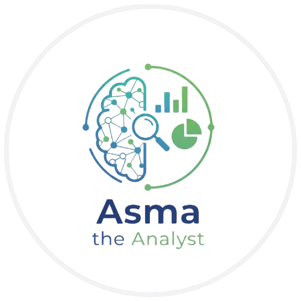
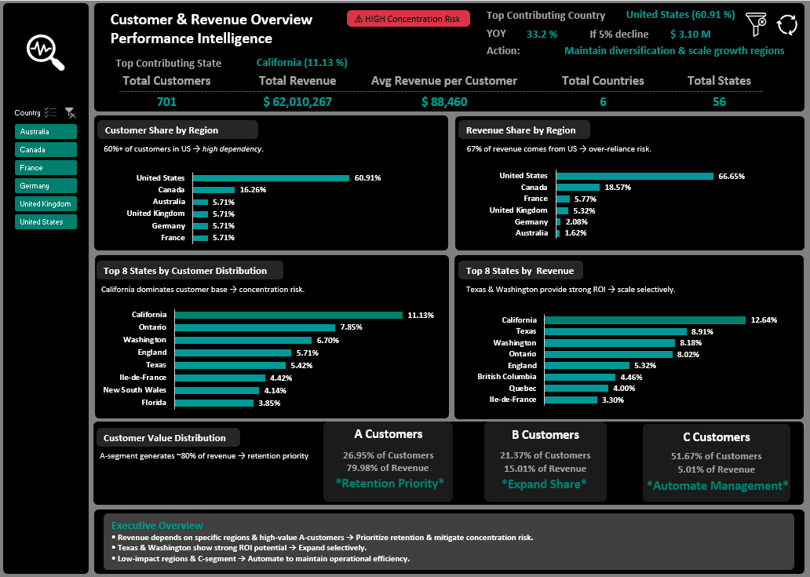
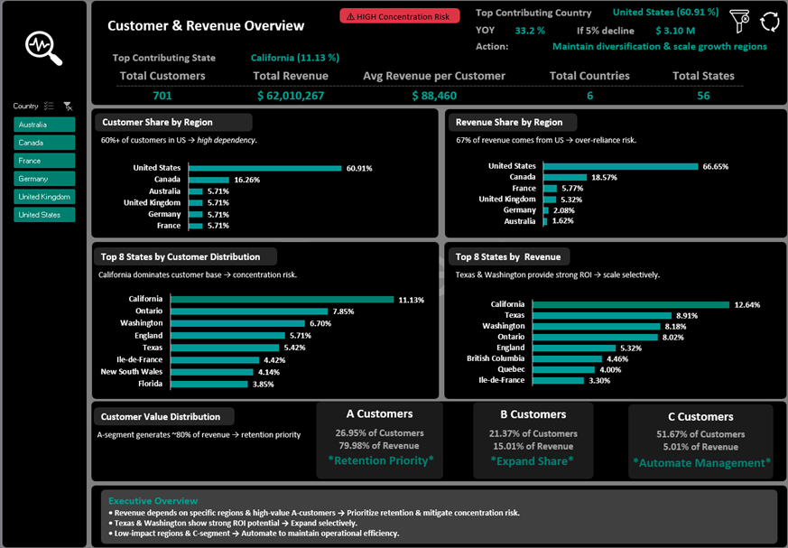
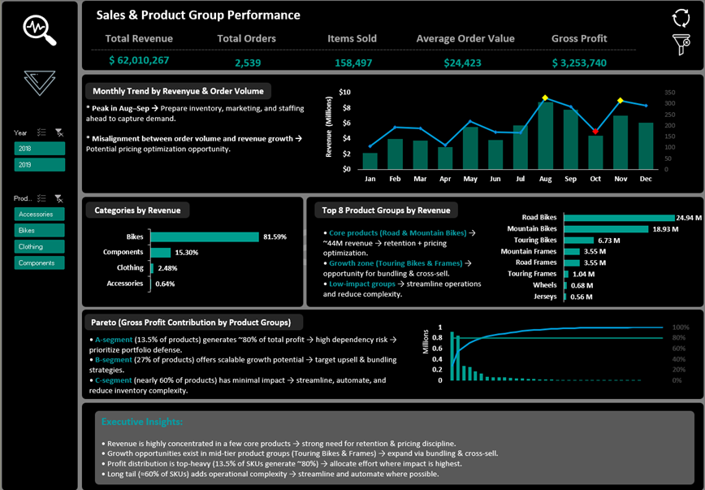
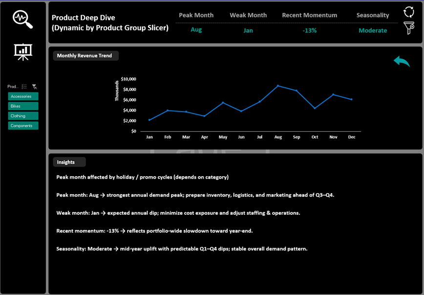
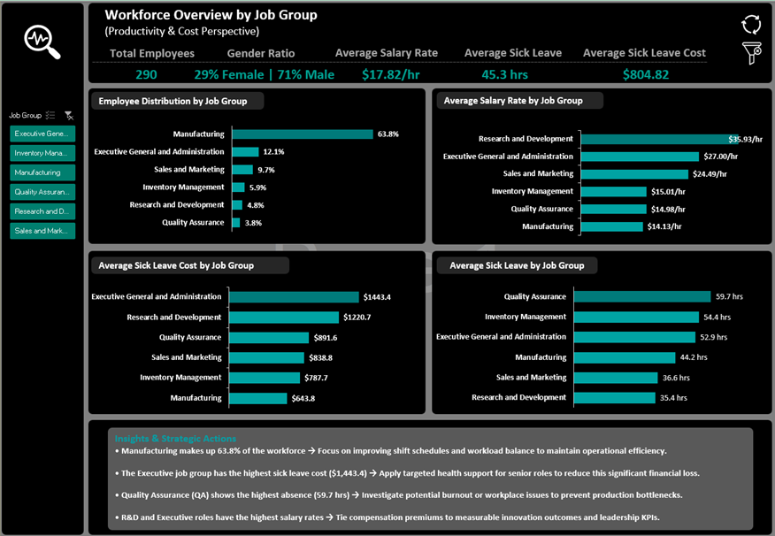

<div dir="rtl" align = "justify">

# 📊 مجموعه هوشمندی عملکرد فروش و مشتریان (داشبوردهای BI در Excel)



### *مرور مشتری و درآمد • عملکرد فروش و گروه‌های محصول (با تحلیل عمیق محصول) • مرور نیروی انسانی*

تمرکز درآمد | تحلیل پارتو | هوشمندی نیروی انسانی

---


---

<div align ="center">



</div>

---

## 🔹 معرفی پروژه

این پروژه مجموعه‌ای از داشبوردهای تحلیلی در **Microsoft Excel** است که برای بررسی هم‌زمان عملکرد فروش، رفتار مشتریان، وضعیت محصولات و شاخص‌های نیروی انسانی طراحی شده است.

هدف پروژه تبدیل داده‌های عملیاتی پراکنده به **یک مدل تحلیلی یکپارچه** است تا مدیران بتوانند الگوهای درآمد، تمرکز بازار، عملکرد محصولات و وضعیت منابع انسانی را در یک نگاه بررسی کنند و تصمیم‌های آگاهانه‌تری بگیرند.

نتایج تحلیل نشان می‌دهد که اگرچه کسب‌وکار از نظر درآمد عملکرد مطلوبی دارد، اما بخش قابل توجهی از آن به تعداد محدودی **بازار، مشتری و گروه محصول** وابسته است. همچنین برخی شاخص‌های منابع انسانی نشان می‌دهد که در واحدهایی مانند **کنترل کیفیت** و **مدیریت موجودی** سطح غیبت کارکنان می‌تواند در بلندمدت به فشار عملیاتی تبدیل شود.

در مجموع، این داشبوردها به شناسایی **ریسک تمرکز درآمد، پیچیدگی پورتفولیوی محصول و نقاط آسیب‌پذیر نیروی انسانی** کمک می‌کنند و مسیرهایی برای بهبود عملکرد و رشد پایدار ارائه می‌دهند.

---

## 📸 نمای کلی داشبوردها

### Customer & Revenue Overview

<div align ="center">



</div>

### Sales & Product Group Performance

<div align ="center">



</div>

### Product Deep Dive

<div align ="center">



</div>

### Workforce Overview

<div align ="center">



</div>

---

## 🌟 خلاصه مدیریتی

این پروژه داده‌های مربوط به **مشتریان، فروش، محصولات و نیروی انسانی** را در یک راهکار BI مبتنی بر Excel یکپارچه می‌کند.

تحلیل‌ها نشان می‌دهد که عملکرد کلی کسب‌وکار مناسب است، اما بخش بزرگی از درآمد از تعداد محدودی **بازار، گروه مشتری و دسته محصول** حاصل می‌شود. بازار ایالات متحده سهم غالب را دارد (**66.65% از کل درآمد**)، مشتریان **A‑Segment** (26.95% از مشتریان) بیشترین درآمد را ایجاد می‌کنند (**~80%**) و دسته محصول **Bikes** هسته اصلی فروش را تشکیل می‌دهد (**81.59% از کل درآمد**).

در کنار آن، داده‌های نیروی انسانی نشان می‌دهد که در بخش‌هایی مانند **Quality Assurance** (با میانگین 59.7 ساعت غیبت) و **Inventory Management** (با میانگین 54.4 ساعت غیبت) سطح مرخصی استعلاجی نسبتاً بالا است که می‌تواند نشان‌دهنده فشار عملیاتی در این واحدها باشد. بالاترین هزینه میانگین مرخصی استعلاجی نیز در گروه **Executive** (1,443.40 دلار به ازای هر نفر) مشاهده می‌شود.

در مجموع، یافته‌ها نشان می‌دهد که رشد آینده نباید تنها بر حوزه‌های فعلی متکی باشد. **تنوع‌بخشی به منابع درآمد، بهینه‌سازی پورتفولیوی محصول و پایداری بیشتر نیروی انسانی** می‌تواند تاب‌آوری بلندمدت کسب‌وکار را افزایش دهد.

---

## 📊 شاخص‌های کلیدی

- **تمرکز بازار:** بازار آمریکا **60.91٪ از مشتریان** و **66.65٪ از کل درآمد** را تشکیل می‌دهد.
- **توزیع پارتو:** حدود **13.5٪ از SKUها** نزدیک به **80٪ از سود ناخالص** را ایجاد می‌کنند، در حالی که مشتریان **A‑Segment** (26.95٪ از مشتریان) حدود **80٪ از درآمد** را تولید می‌کنند.
- **غلبه یک دسته محصول:** گروه **Bikes** حدود **81.59٪ از کل درآمد** را تشکیل می‌دهد.
- **ریسک نیروی انسانی:** بیشترین میانگین ساعات غیبت مربوط به **QA (59.7 ساعت)** و **Inventory (54.4 ساعت)** است.

---

## 🎯 مسئله کسب‌وکار

شرکت در چندین **بخش مشتری، دسته محصول و واحد سازمانی** فعالیت می‌کند، اما ساختار گزارش‌دهی موجود دید یکپارچه‌ای از عملکرد کل کسب‌وکار ارائه نمی‌داد.

در نتیجه:

- شناسایی تمرکز واقعی درآمد دشوار بود
- تشخیص حوزه‌های عملکرد قوی یا ضعیف به سادگی ممکن نبود
- برخی ریسک‌های عملیاتی در داده‌ها پنهان باقی می‌ماندند

بدون یک سیستم داشبورد تحلیلی یکپارچه، تصمیم‌گیری بیشتر **واکنشی** بود تا **استراتژیک**.

---

## اهداف پروژه

این پروژه با اهداف زیر طراحی شد:

- یکپارچه‌سازی داده‌های **فروش، مشتری، محصول و منابع انسانی**
- شناسایی **ریسک تمرکز درآمد** در بازارها، مشتریان و دسته‌های محصول
- تحلیل عملکرد محصولات و الگوهای تقاضای ماهانه
- بررسی شاخص‌های نیروی انسانی مانند **توزیع حقوق و هزینه مرخصی استعلاجی**
- ارائه بینش‌های کلیدی در قالب **داشبوردهای تعاملی**

---

## 🔍 بینش‌های کلیدی

### ۱) مرور مشتری و درآمد

این داشبورد بر توزیع مشتریان، تمرکز درآمد و وابستگی بازار تمرکز دارد.

- **ایالات متحده** **۶۶.۶۵٪ از کل درآمد** را به خود اختصاص داده است، در حالی که **۶۰.۹۱٪ از مشتریان** را در خود جای داده است. این موضوع نشان‌دهنده وابستگی قوی به یک بازار است.
- **کالیفرنیا** به تنهایی **۱۲.۶۴٪ از درآمد** را از **۱۱.۱۳٪ از مشتریان** تأمین می‌کند و آن را به مهم‌ترین ایالت در پورتفولیو تبدیل کرده است.
- **مشتریان A-Segment** **۲۶.۹۵٪ از پایگاه مشتریان** را تشکیل می‌دهند اما نزدیک به **۸۰٪ از کل درآمد** را ایجاد می‌کنند.
- در مقابل، **مشتریان C-Segment** **۵۱.۶۷٪ از مشتریان** را تشکیل می‌دهند در حالی که تنها **۵.۰۱٪ از درآمد** را به خود اختصاص می‌دهند.
- پس از کالیفرنیا، **تگزاس** و **واشنگتن** به عنوان قوی‌ترین مشارکت‌کنندگان درآمدی بعدی برجسته هستند.

**اهمیت:** شرکت دارای یک پایگاه مشتری قوی است، اما درآمد در سهم نسبتاً کوچکی از بازارها و گروه‌های مشتری متمرکز شده است. این موضوع هم فرصت و هم ریسک ایجاد می‌کند.

---

### ۲) عملکرد فروش و گروه‌های محصول

این داشبورد به سهم دسته‌بندی‌ها، تمرکز SKU و کارایی کلی پورتفولیو می‌پردازد.

<div dir="rtl" align="justify">
  <ul style="line-height: 1.8;">
    <li>دسته‌بندی <strong>Bikes</strong> (دوچرخه) <strong>۸۱.۵۹٪ از کل درآمد</strong> را تولید می‌کند و آن را به بخش غالب محصولات تبدیل کرده است.</li>
    <li>سهم کوچکی از محصولات، بخش عمده‌ای از کسب‌وکار را هدایت می‌کنند؛ حدود <strong>۱۳.۵٪ از SKUها حدود ۸۰٪ از کل سود ناخالص</strong> را تشکیل می‌دهند.</li>
    <li>گروه‌های محصول مانند <strong>Touring Bikes</strong> (دوچرخه‌های توریستی) و <strong>Frames</strong> (فریم‌ها) فضایی برای توسعه تجاری گسترده‌تر ارائه می‌دهند.</li>
    <li>در عین حال، مجموعه بزرگ «دم دراز» (long-tail assortment) سود ناخالص کمی ایجاد می‌کند اما <strong>پیچیدگی عملیاتی را به طور قابل توجهی افزایش می‌دهد.</strong></li>
  </ul>
</div>

**اهمیت:** پورتفولیو شامل برنده‌های واضحی است، اما وسیع‌تر از حد لازم نیز می‌باشد. ترکیب محصول انتخابی‌تر می‌تواند پیچیدگی را بدون آسیب رساندن به درآمد کاهش دهد.

---

### ۳) تحلیل عمیق محصول

این بخش روندهای ماهانه و الگوهای فصلی را در داشبورد فروش بررسی می‌کند.

- درآمد در اواسط سال افزایش می‌یابد و در **ماه آگوست به اوج خود** می‌رسد.
- **ژانویه** ضعیف‌ترین ماه است.
- در اواخر سال، شتاب درآمد با کاهشی حدود **۱۳٪** روبرو می‌شود.

**اهمیت:** کسب‌وکار در تمام ماه‌ها به یک اندازه قوی نیست. برنامه‌ریزی فصلی برای موجودی، کمپین‌ها و کارکنان به هموار کردن عملکرد کمک می‌کند.

---

### ۴) مرور نیروی انسانی

این داشبورد بر توزیع نیروی کار، ساختار هزینه و الگوهای غیبت تمرکز دارد.

- **۶۳.۸٪ از کارمندان** در **Manufacturing** (تولید) هستند، که نشان‌دهنده تمرکز بالای ظرفیت عملیاتی است.
- **R&D** (تحقیق و توسعه) بالاترین حقوق ساعتی را با **۳۵.۹۳ دلار** دارد، و پس از آن نقش‌های **Executive** (مدیریتی) با **۲۷.۰۰ دلار** قرار دارند.
- **Quality Assurance** (تضمین کیفیت) و **Inventory Management** (مدیریت موجودی) بالاترین میانگین ساعات مرخصی استعلاجی را گزارش می‌کنند: به ترتیب **۵۹.۷** و **۵۴.۴**.
- بالاترین هزینه میانگین مرخصی استعلاجی در گروه **Executive** با **۱,۴۴۳.۴۰ دلار** به ازای هر کارمند دیده می‌شود.

**اهمیت:** نیروی انسانی نه تنها یک مرکز هزینه است، بلکه بر تداوم کسب‌وکار نیز تأثیر می‌گذارد. غیبت بالا در نقش‌های عملیاتی کلیدی می‌تواند اختلالاتی فراتر از معیارهای منابع انسانی ایجاد کند.

---

## 📊 نمای کلی شاخص‌های کلیدی عملکرد (KPI)

### عملکرد فروش و مالی
- **کل درآمد:** ۶۲,۰۱۰,۲۶۷ دلار
- **سود ناخالص:** ۳,۲۵۳,۷۴۰ دلار
- **کل سفارشات:** ۲,۵۳۹
- **تعداد اقلام فروخته شده:** ۱۵۸,۴۹۷
- **میانگین ارزش سفارش:** ۲۴,۴۲۳ دلار

### ساختار مشتری و بازار
- **کل مشتریان:** ۷۰۱
- **سهم مشتریان آمریکا:** ۶۰.۹۱٪
- **سهم درآمد آمریکا:** ۶۶.۶۵٪
- **سهم مشتریان کالیفرنیا:** ۱۱.۱۳٪
- **سهم درآمد کالیفرنیا:** ۱۲.۶۴٪
- **سهم مشتریان A-Segment:** ۲۶.۹۵٪
- **سهم درآمد A-Segment:** ۷۹.۹۸٪

### پورتفولیوی محصول
- **دسته برتر:** Bikes (دوچرخه)
- **سهم درآمد Bikes:** ۸۱.۵۹٪
- **SKU با سود بالا:** ۱۳.۵٪ از SKUها حدود ۸۰٪ سود ناخالص را تولید می‌کنند.
- **ماه اوج تقاضا:** آگوست
- **ماه کمترین تقاضا:** ژانویه
- **تغییر اخیر در شتاب:** -۱۳٪

### شاخص‌های نیروی انسانی
- **کل کارمندان:** ۲۹۰
- **سهم Manufacturing:** ۶۳.۸٪
- **میانگین نرخ ساعتی:** ۱۷.۸۲ دلار
- **بالاترین نرخ ساعتی:** R&D – ۳۵.۹۳ دلار/ساعت
- **نرخ ساعتی Executive:** ۲۷.۰۰ دلار/ساعت
- **میانگین هزینه مرخصی استعلاجی:** ۸۰۴.۸۲ دلار
- **بالاترین هزینه مرخصی استعلاجی گروه:** Executive – ۱,۴۴۳.۴۰ دلار

---

## 🚀 ریسک‌های استراتژیک

- وابستگی شدید به **بازار ایالات متحده**
- تمرکز درآمدی در **مشتریان A-Segment**
- اتکای بیش از حد به دسته‌بندی **Bikes** (دوچرخه)
- پورتفولیوی گسترده محصول با **ارزش تجاری محدود (مجموعه دم دراز)**
- فشار عملیاتی ناشی از مرخصی استعلاجی در بخش‌های **QA** (تضمین کیفیت) و **Inventory Management** (مدیریت موجودی)

---

## 🎯 اقدامات پیشنهادی

- حفاظت از روابط با مشتریان با ارزش بالا، به ویژه در سودآورترین بخش.
- کاهش تمرکز بازار در طول زمان با تقویت تلاش‌های فروش خارج از پایگاه درآمد اصلی.
- بررسی SKUهای با عملکرد پایین و ساده‌سازی پورتفولیوی محصول در صورت امکان.
- توسعه گروه‌های محصول مجاور با استراتژی‌های **فروش مکمل (cross-sell) یا بسته‌بندی (bundling)**.
- پایش روندهای غیبت در بخش‌های عملیاتی و رسیدگی زودهنگام به مسائل احتمالی حجم کاری.

---

## 🧭 جمع‌بندی نهایی

شرکت در حال ایجاد درآمد قوی است، اما بخش زیادی از آن عملکرد به مجموعه محدودی از عوامل کلیدی وابسته است. داشبوردها مشاهده این تمرکز و فشارهای احتمالی آینده را آسان‌تر می‌کنند.

از منظر کسب‌وکار، اولویت اصلی نه تنها رشد، بلکه رشد متعادل‌تر است. کاهش وابستگی به چند بازار، محصول و گروه مشتری کلیدی، عملکرد را در طول زمان پایدارتر خواهد کرد.

---

## 📈 تأثیر تجاری

این تحلیل به کسب‌وکار امکان می‌دهد تا:

- ریسک تمرکز درآمد را کاهش دهد.
- پیچیدگی پورتفولیوی محصول را بهینه کند.
- پیش‌بینی و برنامه‌ریزی استراتژیک را تقویت کند.
- تاب‌آوری عملیاتی را در بین تیم‌ها بهبود بخشد.
- هزینه‌های بلندمدت منابع انسانی و غیبت را کاهش دهد.

---

## 📂 ساختار پروژه

<div dir="ltr">

```text
Sales_Customer_Performance_Intelligence_Suite/
├─ Dashboards/
│   ├─ 01_Customer_Overview.xlsm
│   ├─ 02_Sales_Product_Performance.xlsm  (شامل تحلیل عمیق محصول)
│   └─ 03_Workforce_Overview.xlsm
├─ Executive_Summary/
│   ├─ Business_Insight_Summary.pdf
│   └─ Business_Insight_Summary_FA.pdf
├─ Images/
│   ├─ Data_Model.png
│   ├─ Customer_Dashboard.png
│   ├─ Sales_Dashboard.png
│   ├─ Product_Deep_Dive.png
│   ├─ Workforce_Dashboard.png
│   ├─ Business_Analysis_Animation.gif
│   └─ logo.png
├─ Data/
│   ├─ Sales_Data.xlsx
│   └─ HR_Data.xlsx
├─ README.md
└─ README_FA.md
```

</div>

---

## ▶️ نحوه استفاده

1.  فایل‌های داشبورد اکسل (`.xlsm`) را دانلود کنید.
2.  هنگام باز کردن فایل‌ها، ماکروها را فعال کنید.
3.  از فیلترها (Slicers) و فیلترهای معمولی برای کاوش بخش‌های مشتری، محصول و نیروی انسانی استفاده کنید.
4.  ابتدا شاخص‌های کلیدی عملکرد (KPIs) را بررسی کنید، سپس برای درک عمیق‌تر به نمودارها مراجعه نمایید.
5.  برای تحلیل روند ماهانه و الگوهای فصلی، به شیت `Product Deep Dive` مراجعه کنید.

---

## 🗃 مجموعه داده (Dataset)

پنج مجموعه داده در تمام داشبوردها استفاده شده است (که در Power Query تمیز شده و در Power Pivot مدل‌سازی شده‌اند):

- **منبع داده:** پایگاه داده نمونه Microsoft AdventureWorks

<div dir = "ltr" align = "center">

| جدول (Table)      | رکوردها (Records) | ستون‌های کلیدی (Key Columns)                                   |
| ----------------- | ------------------ | -------------------------------------------------------------- |
| **Customers**    | 701                | `CustomerID`, `Country`, `State`, `City`, `HasOrders`                                           |
| **Order_Items**  | 43,470             | `SalesOrderID`, `OrderQty`, `ProductID`, `UnitPrice`, `LineTotal`                               |
| **Orders**       | 2,539              | `SalesOrderID`, `OrderDate`, `DueDate`, `CustomerID`, `SalesPersonID`, `TotalDue`                 |
| **Products**     | 293                | `ProductID`, `StandardCost`, `ListPrice`, `Sub Category`, `Category`                            |
| **Staff**        | 290                | `EmployeeID`, `Title`, `Department`, `Group`, `Gender`, `Rate`, `SickLeaveHours`                |

</div>

- **محدوده زمانی:** 2018–2019

---

## 🛠 ابزارها و مهارت‌های فنی

-   **تبدیل داده (Data Transformation):** Power Query (زبان M) برای ETL، پاکسازی داده‌ها و **نرمال‌سازی ساختاری**.
-   **مدل‌سازی داده (Data Modeling):** Power Pivot با استفاده از **DAX (Data Analysis Expressions)** برای ایجاد معیارهای پیچیده و **برقراری مدل ارتباطی Star Schema**.
-   **تحلیل پیشرفته (Advanced Analytics):** پیاده‌سازی معیارهای **تقسیم‌بندی محصولات ABC**، **تحلیل درآمد پارتو (80/20)** و **تمرکز سهم بازار** برای شناسایی محرک‌های کلیدی کسب‌وکار.
-   **مصورسازی (Visualization):** PivotTables، PivotCharts و قالب‌بندی شرطی پیشرفته برای گزارش‌دهی در سطح اجرایی.
-   **اتوماسیون (Automation):** تعاملات مبتنی بر VBA (مانند **بازنشانی Slicer**، ناوبری) برای بهبود تجربه کاربری (UI/UX).
-   **هوش تجاری (Business Intelligence):** **روایتگری استراتژیک**، **شناسایی ریسک‌های تمرکز درآمد** و ارائه **توصیه‌های عملیاتی قابل اجرا**.

---

## معماری فنی داده (مدل‌سازی داده)

پروژه از یک Star Schema (طرح ستاره‌ای) **بهینه‌سازی شده برای کوئری‌های تحلیلی** استفاده می‌کند. مدل داده، **یکپارچگی ارجاعی (referential integrity)** را تضمین کرده و از **محاسبات پیچیده DAX در ابعاد متعدد** پشتیبانی می‌کند:

-   **جداول واقعیت (Fact Tables):** Orders (در سطح سربرگ)، Order_Items (**در سطح جزئیات**).
-   **جداول ابعاد (Dimension Tables):** Customer (جمعیت‌شناسی)، Products (سلسله مراتب)، Staff (عملکرد منابع انسانی) و Calendar (**هوش زمانی**).
-   **روابط کلیدی (Key Relationships):** روابط **1:N (یک به چند)** برای اطمینان از **جریان صحیح فیلتر از ابعاد به جداول واقعیت** برقرار شده است، که امکان **"Slicing and Dicing" دقیق KPIها** را فراهم می‌کند.

---

## 📁 خروجی‌های نهایی (Deliverables)

👈 **خلاصه مدیریتی (انگلیسی) ([PDF – English](Executive_Summary/Sales_and_Customer_Performance_Intelligence_Suite_Insight_Summary.pdf)):**
تحلیل استراتژیک عمیق ریسک‌های تمرکز درآمد، تقسیم‌بندی مشتریان بر اساس پارتو و ممیزی کارایی نیروی انسانی با توصیه‌های رشد عملیاتی.

👈 **خلاصه مدیریتی (فارسی) ([PDF – Persian](Executive_Summary/Sales_and_Customer_Performance_Intelligence_Suite_Insight_Summary_FA.pdf)):** 
نسخه فارسی خلاصه مدیریتی برای درک بهتر ذینفعان محلی.

👈 **راهنمای داشبورد (GIF) ([Dashboard Walkthrough – GIF](Images/Business_Analysis_Animation.gif)):** 
یک راهنمای تعاملی که توزیع جغرافیایی مشتریان، عملکرد بخش‌بندی ABC، روندهای فصلی محصولات و کارایی عملیاتی نیروی انسانی را نمایش می‌دهد.

----

## 👤 درباره نویسنده

**اسما سیستانی — تحلیلگر داده و طراح BI**  
تبدیل داده‌های تجاری و عملیاتی به **هوش آماده برای تصمیم‌گیری**.

💻 **GitHub:** [](https://github.com/asma-sistani)

🔗 **LinkedIn:** [](https://www.linkedin.com/in/asma-sistani)

🌐 **Portfolio:** [](https://asmatheanalyst.github.io/portfolio.html)

---

**شفافیت داده‌ها منجر به تصمیمات هوشمندانه می‌شود. تصمیمات هوشمندانه عملکرد را هدایت می‌کنند.**

---


</div>

